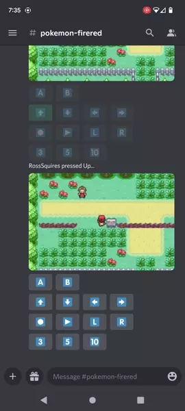

[](https://discord.gg/dbcnjr9tp9)

# Retrobot

Retrobot is a Discord bot that allows you to play NES/SNES/GB/GBA games with your friends over chat! Think "TwitchPlaysPokemon", but with GIFs. It accepts button presses, emulates the result, and encodes a GIF to view.



## Input Assist
Retrobot simplifies control by auto-forwarding through idle parts of games, such as conversations or battle animations. 

Additionally, numbered buttons are added to automatically repeat button presses. This is useful for walking in a specific direction for a long period.

## How to Use
Create a bot in the [Discord Developer Portal](https://discord.com/developers/applications), and obtain a token for your bot.

Create a file name exactly `.env` in your clone of this repository with the following contents:
```
DISCORD_TOKEN=YOUR DISCORD TOKEN HERE
```

Run these commands:
```
yarn install
yarn start
```

Then invite the bot to a server with the following URL. Be sure to update the OAuth Client ID.
```
https://discord.com/api/oauth2/authorize?client_id=YOUR_OAUTH_CLIENT_ID_HERE&permissions=68608&scope=bot
```

Once the bot has joined your Discord server, drop an uncompressed ROM file into a channel. The bot will automatically find the ROM file, and begin emulation. Note: only server "administrators" can start new games.

## Running as a Daemon
If you'd like a simple way to run the bot as a background service, there's a helper `yarn` script. It will fire up the bot as a background service, and record logs to `./forever/retrobot.log`
```
yarn service:start
```
And to stop:
```
yarn service:stop
```
## Technical Notes
Retrobot is built on [`libretro`](https://github.com/libretro/libretro-common), the code that powers [RetroArch](https://www.retroarch.com/). Several `libretro` cores have been cross-compiled to WASM to be used in [Node.js](https://www.retroarch.com/). Since WASM modules have independent memory spaces, it means several cores of the same type can be instanced. This allows parallelism.

## License
The bot source code here is licensed as MIT. The `libretro` core each have their own licenses.
* mGBA - https://github.com/libretro/mgba/blob/master/LICENSE
* QuickNES - https://github.com/libretro/QuickNES_Core/blob/master/LICENSE
* snes9x2010 - https://github.com/libretro/snes9x2010/blob/master/LICENSE.txt
